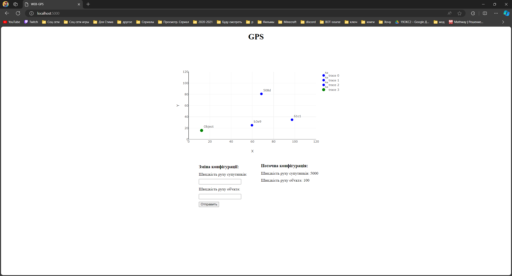

`Ярощук Александр Михайлович ИПЗ 4.04`
## GPS

## Web App
Приложение сделано на python, для отображение графического интерфейса GPS.

Когда отстается 2 спутника, обьект становится красным цветом и стоит на месте

Когда становится 4 спутника, обьект становится желтый цветом

Так же для изменение конфигурации измерение для GPS.

